# TP Java Pipeline — Jenkins & Maven

> **Auteur :** Niema El Malki  
> **Dépôt :** [TPJavaPipeLine-Niema_El_Malki](https://github.com/niemaelmalki/TPJavaPipeLine-Niema_El_Malki)  
> **Forké depuis :** [simoks/java-maven-ensi](https://github.com/simoks/java-maven-ensi)

---


## Mise en place de Jenkins via Docker

### 1 — Build de l'image Jenkins personnalisée

Une image Docker `myjenkins` est construite depuis un `Dockerfile` embarquant Jenkins avec Docker CLI et les plugins nécessaires (BlueOcean, docker-workflow).

```bash
docker build -t myjenkins .
```

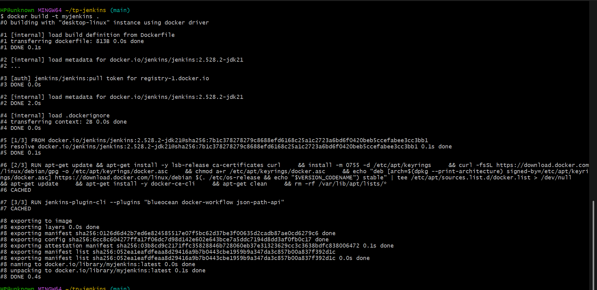

---

### 2 — Démarrage du conteneur Jenkins

```bash
docker run -d --name jenkins \
  -p 8080:8080 -p 50000:50000 \
  --name jenkins myjenkins
```

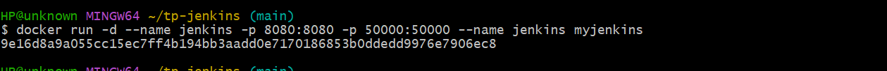

---

### 3 — Installation des plugins Jenkins

Après accès à `http://localhost:8080`, Jenkins installe automatiquement les plugins recommandés : Pipeline, Git plugin, GitHub Branch Source, Credentials Binding, Email Extension, etc.

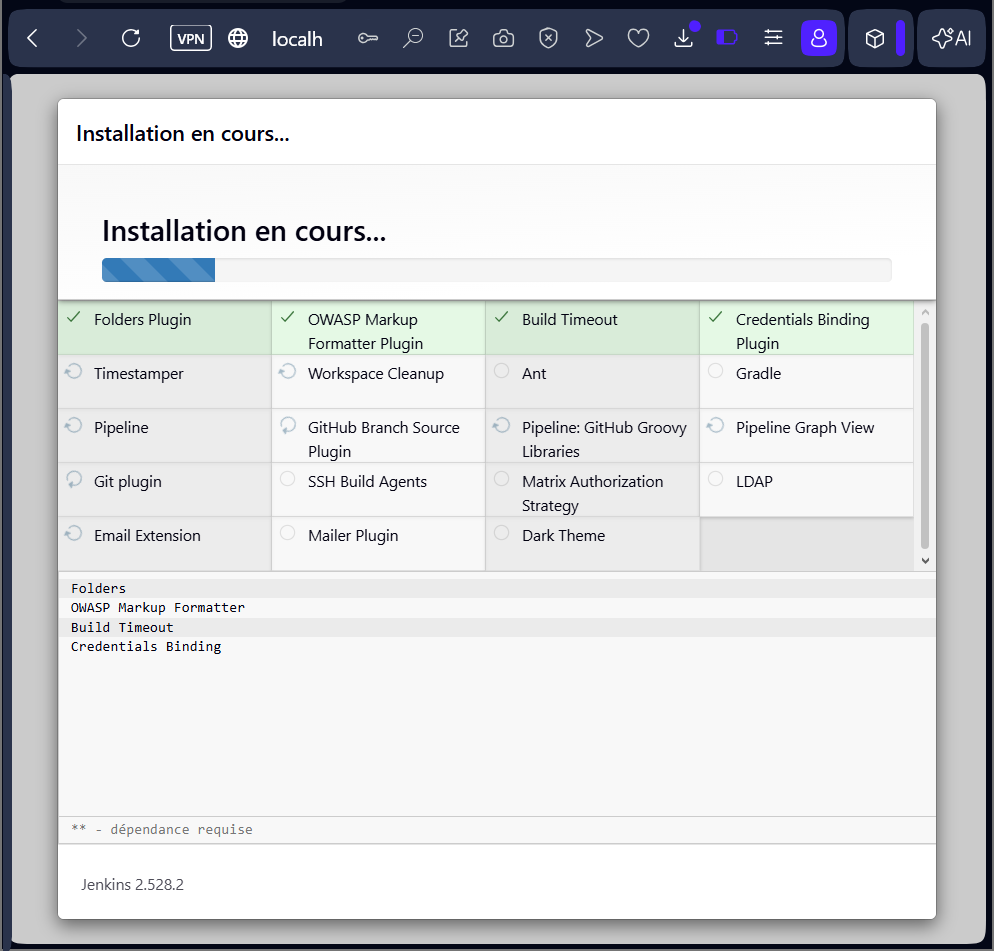

---

### 4 — Récupération du mot de passe initial

```bash
docker exec jenkins cat //var/jenkins_home/secrets/initialAdminPassword
```

> Sur Windows avec Git Bash (MinGW), le double slash `//var/...` est nécessaire pour éviter la conversion automatique du chemin.

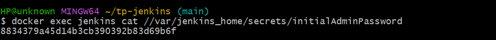

---

### 5 — Création du compte administrateur Jenkins

Un compte administrateur est créé avec les informations suivantes :

- **Nom d'utilisateur :** angeeel66
- **Nom complet :** Niema El Malki
- **Email :** niemaelmalki7@gmail.com

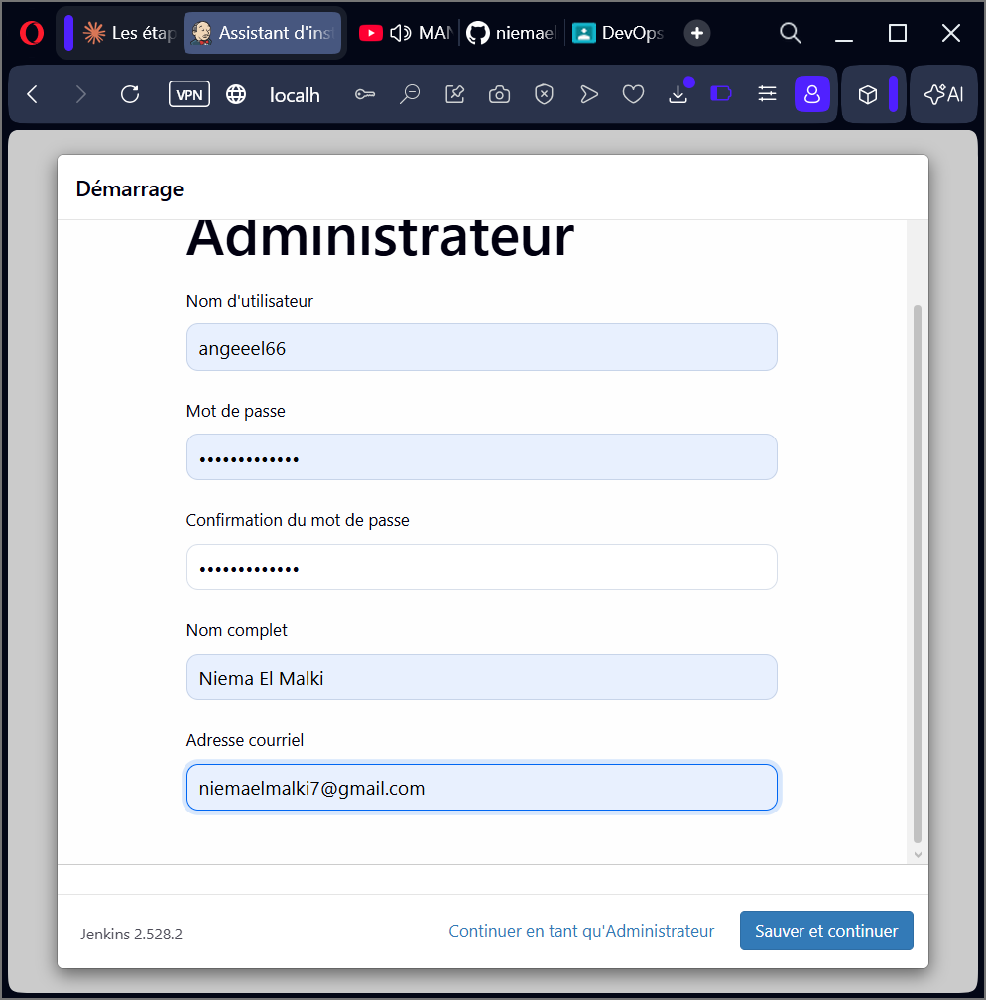


 ---


### 6 — Création du job `pipelineJava` (Pipeline simple)

En parallèle, un job de type **Pipeline** simple nommé `pipelineJava` est également créé pour tester le pipeline manuellement.

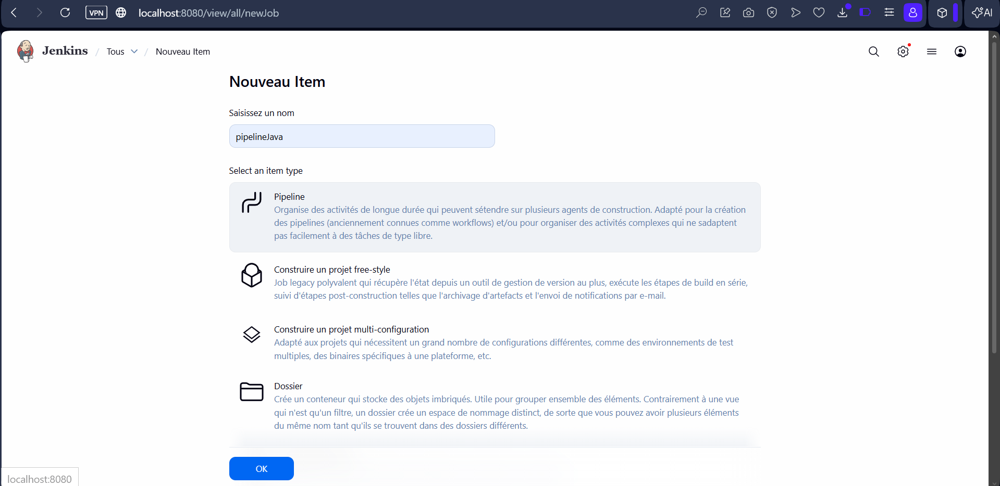

### 7 — Configuration SCM Git du `pipelineJava`

- **SCM :** Git
- **Repository URL :** `https://github.com/niemaelmalki/TPJavaPipeLine-Niema_El_Malki`
- **Branch Specifier :** `*/main`

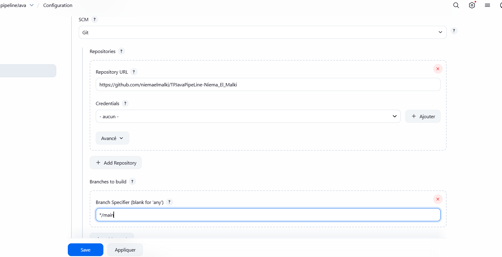

---

## 8. Problèmes rencontrés et solutions

###  Problème 1 — Socket Docker absent, image inaccessible

**Symptôme :** Jenkins ne peut pas communiquer avec le daemon Docker. L'image `my-maven-git:latest` est inaccessible.

**Cause :** Le socket `/var/run/docker.sock` n'était pas monté dans le conteneur Jenkins au premier lancement.

** Solution :** Arrêter, supprimer, et relancer le conteneur avec le socket monté :

```bash
docker stop jenkins
docker rm jenkins
docker run -d --name jenkins \
  -p 8080:8080 -p 50000:50000 \
  -v jenkins_home:/var/jenkins_home \
  -v //var/run/docker.sock:/var/run/docker.sock \
  myjenkins
```

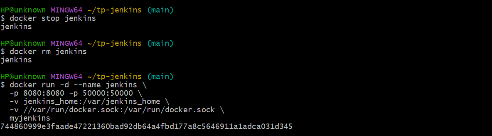

---

###  Problème 2 — `permission denied` sur le socket Docker

**Symptôme :**
```
permission denied while trying to connect to the Docker daemon socket
at unix:///var/run/docker.sock
```

**Cause :** L'utilisateur `jenkins` n'avait pas les droits d'accès au socket Docker.

** Solution :** Entrer dans le conteneur en `root` et corriger les permissions :

```bash
winpty docker exec -u root -it jenkins bash
groupadd docker || true
usermod -aG docker jenkins
chmod 666 /var/run/docker.sock
exit
docker restart jenkins
```


---

### ✅ Pipeline réussi après correction — Build #6

Après résolution des deux problèmes, le build **#6** s'exécute avec succès en **14 secondes** :

- Lancé par : **Niema El Malki**
- Dépôt : `https://github.com/niemaelmalki/TPJavaPipeLine-Niema_El_Malki`
- Branche : `refs/remotes/origin/main`

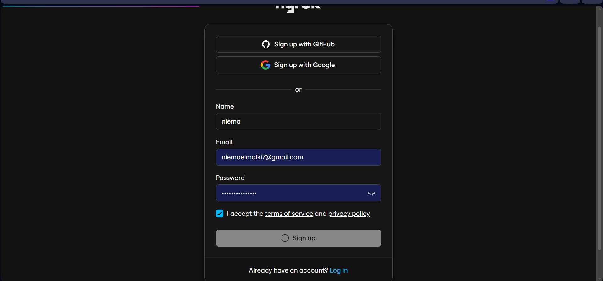

---

## 9. Configuration de ngrok

Pour que GitHub puisse envoyer des Webhooks vers Jenkins tournant en local, **ngrok** crée un tunnel HTTPS public vers `http://localhost:8080`.

### 9.1 — Inscription sur ngrok


### 9.2 — Récupération de l'Authtoken

```bash
ngrok config add-authtoken <votre_token>
```

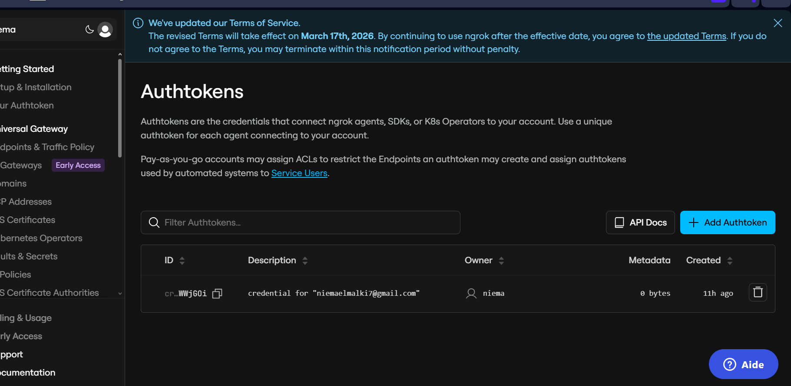

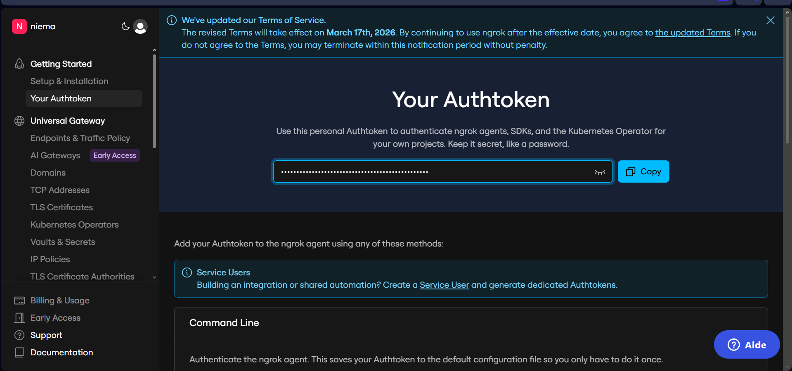

### 9.3 — Lancement du tunnel ngrok

```bash
ngrok http 8080
```

URL publique générée :  
**`https://phrase-hypnoses-impaired.ngrok-free.dev`** → `http://localhost:8080`


---

## 10. Configuration du Webhook GitHub

Dans les paramètres du dépôt : **Settings → Webhooks → Add webhook**

| Paramètre | Valeur |
|-----------|--------|
| **Payload URL** | `https://phrase-hypnoses-impaired.ngrok-free.dev/github-webhook/` |
| **Content type** | `application/json` |
| **SSL verification** | Activée |
| **Événement déclencheur** | `Just the push event` |


### Webhook actif — Livraison réussie ✅


---
### 6 — Création du job `TPJava-Pipeline` (type Multibranches)

Dans Jenkins → **Nouveau Item**, le nom `TPJava-Pipeline` est saisi et le type **Pipeline Multibranches** est sélectionné.


### 7 — Configuration de la source Git (Branch Sources)

- **Project Repository :** `https://github.com/niemaelmalki/TPJavaPipeLine-Niema_El_Malki`
- **Credentials :** aucun (dépôt public)
- **Behaviours :** Discover branches

Jenkins scanne le dépôt, détecte la branche `main` qui contient un `Jenkinsfile`, et crée automatiquement un pipeline pour elle.


---
## 11. Résultat final — Pipeline Multibranches réussi
## 7. Création du Pipeline Multibranches

### Pourquoi un Pipeline Multibranches ?

Le **Pipeline Multibranches** est le type de job le plus adapté pour un projet GitHub car il :
- **Scanne automatiquement toutes les branches** du dépôt
- **Crée un pipeline dédié** pour chaque branche qui contient un `Jenkinsfile`
- **Déclenche automatiquement** un build à chaque push via le Webhook GitHub

Le job **TPJava-Pipeline** (Multibranches) affiche la branche `main` avec un **statut ✅ vert** :

| Champ | Valeur |
|-------|--------|
| **Branche détectée** | `main` |
| **Dernier succès** | Build **#1** |
| **Dernier échec** | s.o. (aucun échec) |
| **Dernière durée** | **32 secondes** |

Jenkins a automatiquement détecté la branche `main`, lu le `Jenkinsfile` à sa racine, et exécuté le pipeline avec succès.


---

## 12. Récapitulatif des captures

| # | Image | Description |
|---|-------|-------------|
| 01 |  | `docker build -t myjenkins .` |
| 02 |  | `docker run` — lancement du conteneur Jenkins |
| 03 |  | Installation des plugins Jenkins |
| 04 |  | Récupération du mot de passe initial |
| 05 |  | Création du compte administrateur |
| 06 |  | Création du job `pipelineJava` |
| 07 |  | Configuration SCM Git |
| 08 | 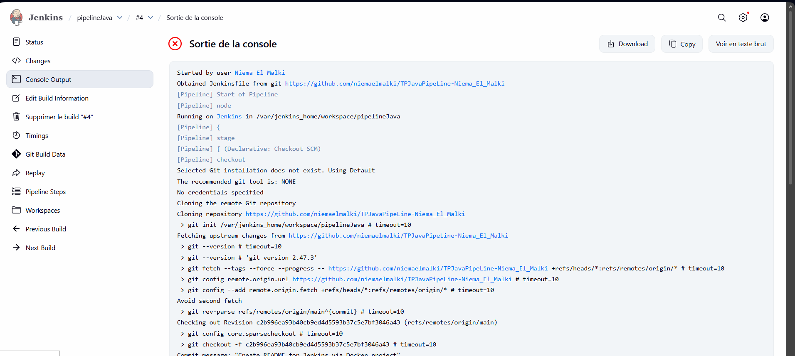 | Relance avec socket Docker monté |
| 09 |  | Correction permissions `docker.sock` |
| 10 | 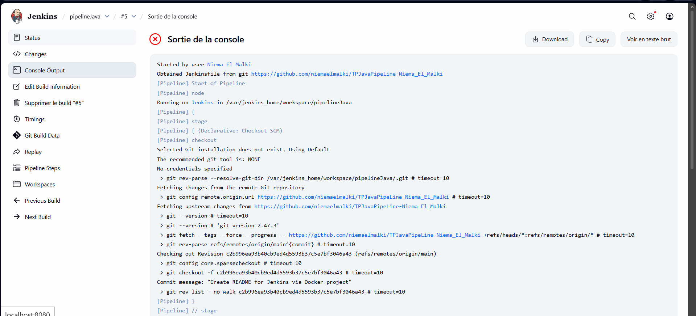 | ✅ Build #6 réussi |
| 11 | 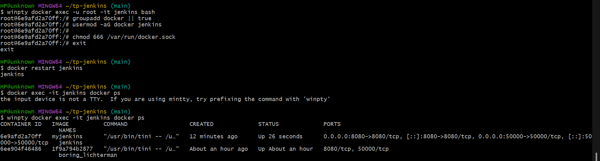 | Inscription ngrok |
| 12 | 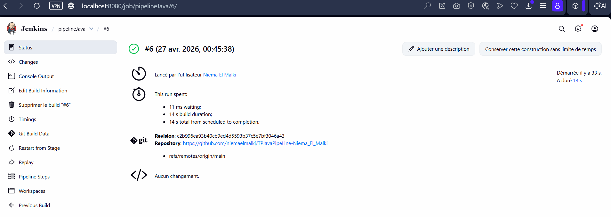 | Authtoken ngrok |
| 13 |  | Token ngrok créé |
| 14 |  | Tunnel ngrok actif |
| 15 |  | Configuration Webhook GitHub |
| 16 | 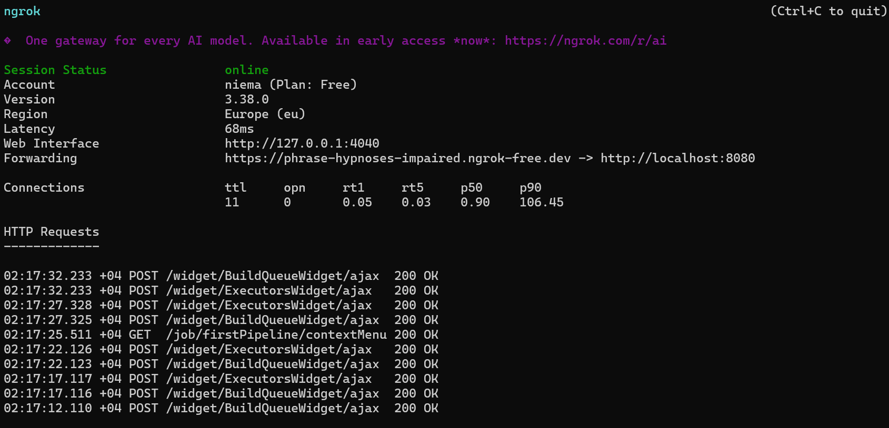 | ✅ Webhook fonctionnel |
| 17 | 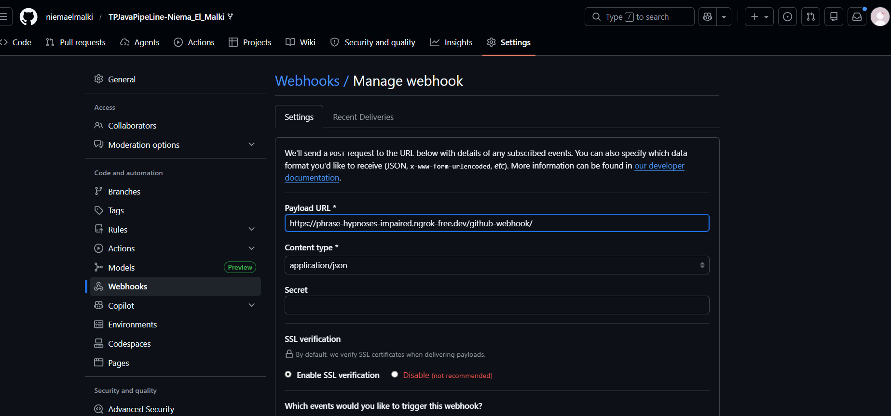 | Branch Sources — Pipeline Multibranches |
| 18 | 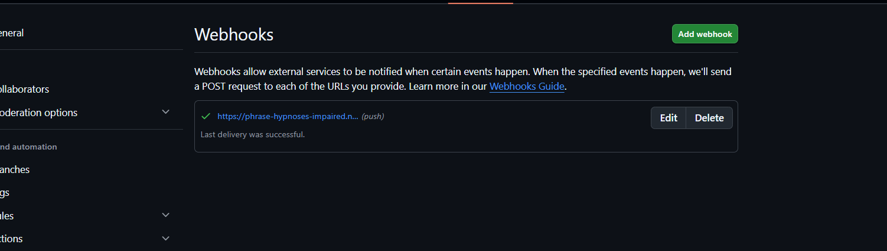 | Vérification `docker ps` |
| 19 | 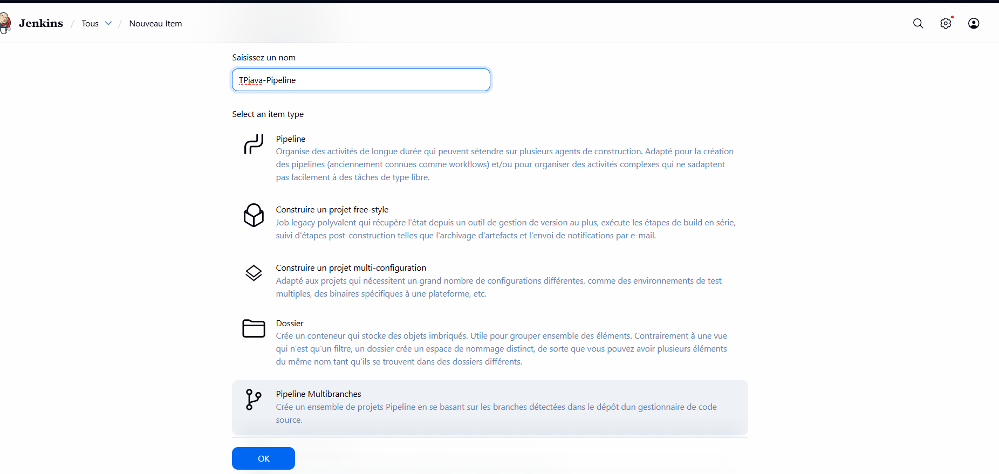 | Création job `TPJava-Pipeline` Multibranches |
| 20 | 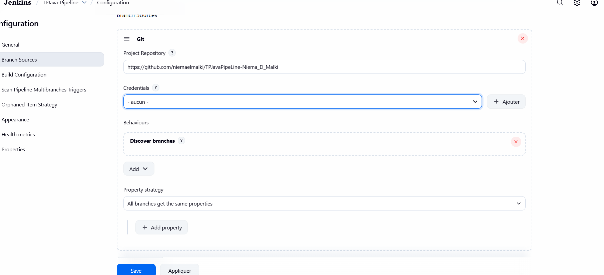 | Création job `TPJava-Pipeline` Multibranches |
| 21 | 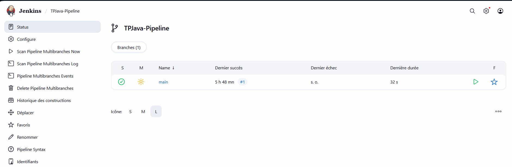 | ✅ Pipeline `main` vert |


---

## 13. Conclusion

| Consigne | Statut |
|----------|--------|
| Dépôt GitHub `TPJavaPipeLine-Niema_El_Malki` | ✅ Créé et public |
| Projet Java compile sans erreur | ✅ Validé via `mvn clean test package` |
| `Jenkinsfile` créé et ajouté au dépôt | ✅ Présent à la racine |
| Webhook GitHub créé et configuré | ✅ Actif — livraison verte |
| Webhook activé dans le pipeline Jenkins | ✅ Scan Pipeline Multibranches Triggers |
| Captures d'exécution insérées dans le README | ✅ 20 captures dans `images/` |
| Rapport rédigé | ✅ Ce document |

Le choix du **Pipeline Multibranches** s'est révélé particulièrement adapté : il détecte automatiquement toutes les branches contenant un `Jenkinsfile`, crée un pipeline pour chacune, et réagit aux Webhooks GitHub pour déclencher les builds en temps réel. Cette approche reflète les pratiques professionnelles du DevOps moderne.
